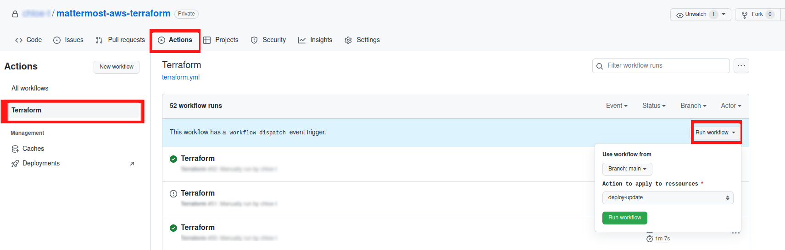

# Deploy

## Trigger Github Action pipeline 

To trigger deployment or destruction, you will have to user GithubActions.
There are three actions defined regarding your infrastructure: 
- **Deploy-Update**: Deploy the infrastructure or update the existing infra.
- **Dry-destroy**: This will list as output what a `terraform destroy` would do, but it is only a dry-run, nothing will be deleted. 
- **Destroy**: Destroys all ressources listed in the dry-run destroy. 

To launch those actions, you'll have to manually trigger the action. 
For that, as exposed on the above screenshot, go to the `Actions` tab of the <ins>mattermost-aws-terraform</ins> repo. 
Then, select the `Terraform` Workflow. From there, you will see a header saying "This workflow has a workflow_dispatch event trigger, select the `Run workflow` button.

Once you've clicked the button, either wait for few econds to see the worklow appear, or refresh the page.

To see logs of the workflow, simply click on it. 

There you will have to choose which action to execute between the three listed before. 

More info: 
https://docs.github.com/en/actions/managing-workflow-runs/manually-running-a-workflow

 

# Access the instance from browser

To access your instance follow those steps: 

- Open the [EC2 console](https://console.aws.amazon.com/ec2/)
- Select the instance named `ec2-mattermost`
- Copy `Public IPv4 DNS` and paste the address in a new tab

- Add ":8065" at the end of the address so you can reach the port Mattermost is exposed at. 
- Congrats! You should land on Mattermost server home page! 
Now, you can follow [Setup Server](./3_setup-server.md) instructions. 

---
__TROUBLESHOT__

<ins>You don't see your instance? </ins>

- Check that your console is in the same AWS Region as the one you've selected in the [pre-requisites](/docs/1_pre-requisites.md#aws_region).
As you can see on the screenshot above, on the top right corner, the EC2 instance is deployed in Ireland (corresponding to `eu-west-1` AWS Region)

---
 
 

# Access the instance from ssh

To access your instance follow those steps: 

- Open the [EC2 console](https://console.aws.amazon.com/ec2/)
- Select the instance named `ec2-mattermost`
- Select `Connect`

- Then choose `SSH client` and follow instructions from your local terminal: 

- As you can see, to connect via SSH from your local terminal to your VM terminal, you'll need the key-pair certificate that you should have generated in [pre-requisite steps](/docs/1_pre-requisites.md#create-an-ec2-key-pair) that you should have downloaded and that should be named `mttmst_kp.pem`.

