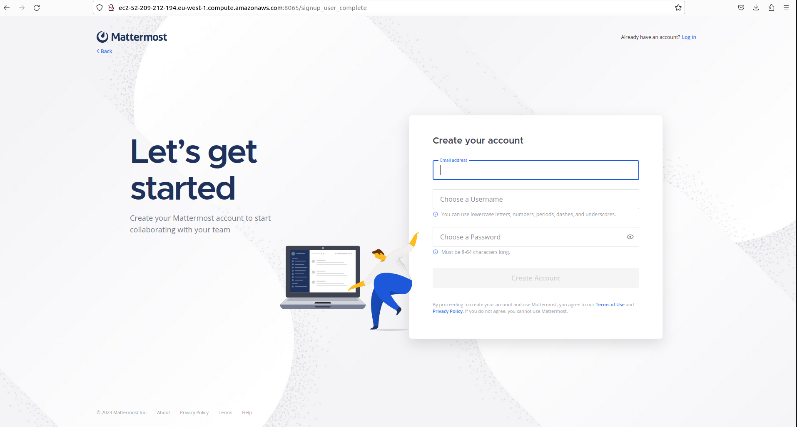

# Setup your Mattermost Server

Once your mattermost server is up, you can now configure it as you want.
The page you'll land on will allow you to create the Admin account.

All steps are detailed [here](https://docs.mattermost.com/install/installing-ubuntu-2004-LTS.html#configure-mattermost-server)